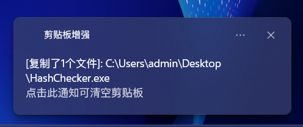
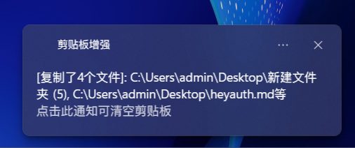
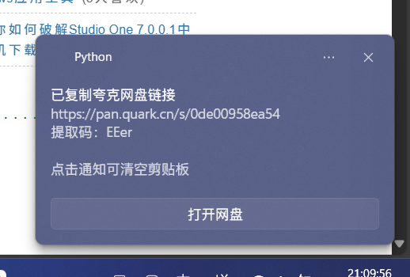
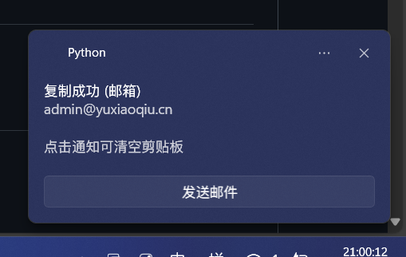
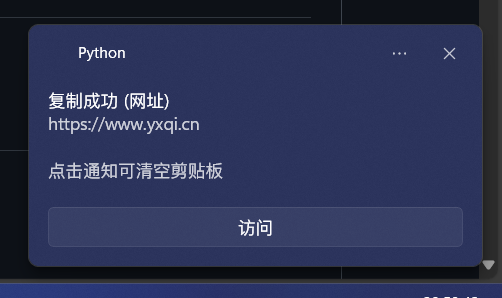
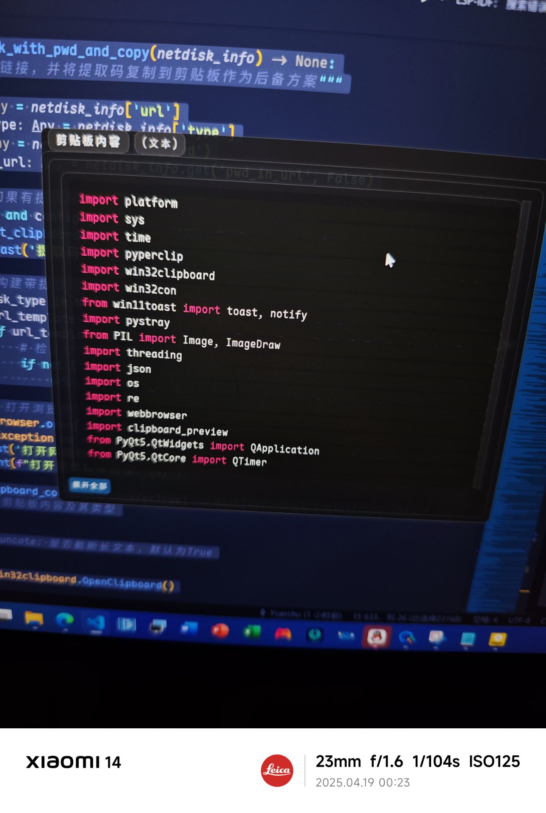

# ClipBoard Enhance 🖨️✨

**实验性项目** | [报告问题](https://github.com/Yuerchu/clipboard-enhance/issues)  
*让Windows剪贴板变得更聪明的小助手*

## 🌄 项目截图

### 纯文字


### 单个文件


### 多个文件


### 图片


### 网盘链接


### 邮箱地址


### 网址


### 语法高亮
> 按住 Ctrl 0.5 秒触发



### 剪贴板错误


## 🌟 核心功能

### 即时反馈
- 实时剪贴板监听，内容变更时弹出`复制成功`通知
- **智能内容识别**：
  - 🌐 网址：显示快速访问按钮（点击用默认浏览器打开）
  - 📧 邮箱：自动启动邮件客户端撰写界面
  - ☁️ 网盘链接（百度/阿里/夸克等）：
    - 自动提取文件链接和提取码
    - 尝试自动填充提取码（支持回退到剪贴板）
    - 注册 `netdisk://` 协议快速识别

### 快捷操作
- 🖱️ **一键清空**：点击通知即可清空剪贴板
- 🔍 **内容预览**：按住 `Ctrl` 键0.5秒弹出悬浮预览框，松手即隐藏

## ⚙️ 安装与配置

### 环境要求
- Windows 10/11
- Python 3.12+ `推荐3.12.2`

### 快速开始
```bash
# 克隆仓库
git clone https://github.com/Yuerchu/ClipBoard-Enhance.git

# 安装依赖
pip install -r requirements.txt

# 首次运行（需管理员权限）
python main.py
```

### 构建
```bash
# 安装依赖
pip install pyinstaller

# 生产环境构建
pyinstaller main.spec

# 测试环境构建，会显示完整终端
pyinstaller debug.spec
```

## 🛠️ 使用说明

### 常规操作
1. 右键以管理员身份运行程序
2. 系统托盘区出现📋图标即表示运行成功
3. 复制任意内容触发通知弹窗

## ⚠️ 注意事项
- 首次运行必须授予管理员权限（用于协议注册）
- 部分安全软件可能误报网络访问行为
- 预览功能需要保持 `Ctrl` 持续按压状态
- 实验性项目，部分功能可能存在兼容性问题

## 🚧 已知问题
- [ ] 高频率复制可能造成通知堆积
- [ ] 链接与网盘的识别能力仅70%可用
- [ ] 部分系统无法正确打开网盘

## 🤝 参与贡献
欢迎通过Issue提交：
1. 使用场景描述
2. 可复现的问题案例
3. 功能改进建议

## 📑 许可证
`GPLv3`

*注：本项目为个人实验性质，维护更新不保证持续性*